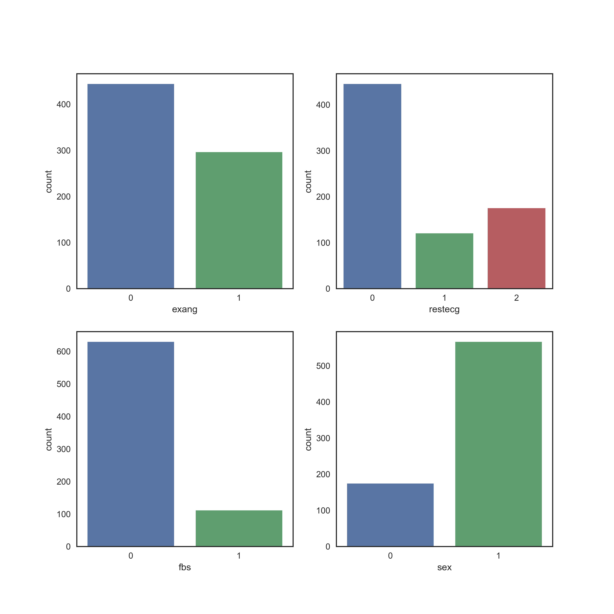
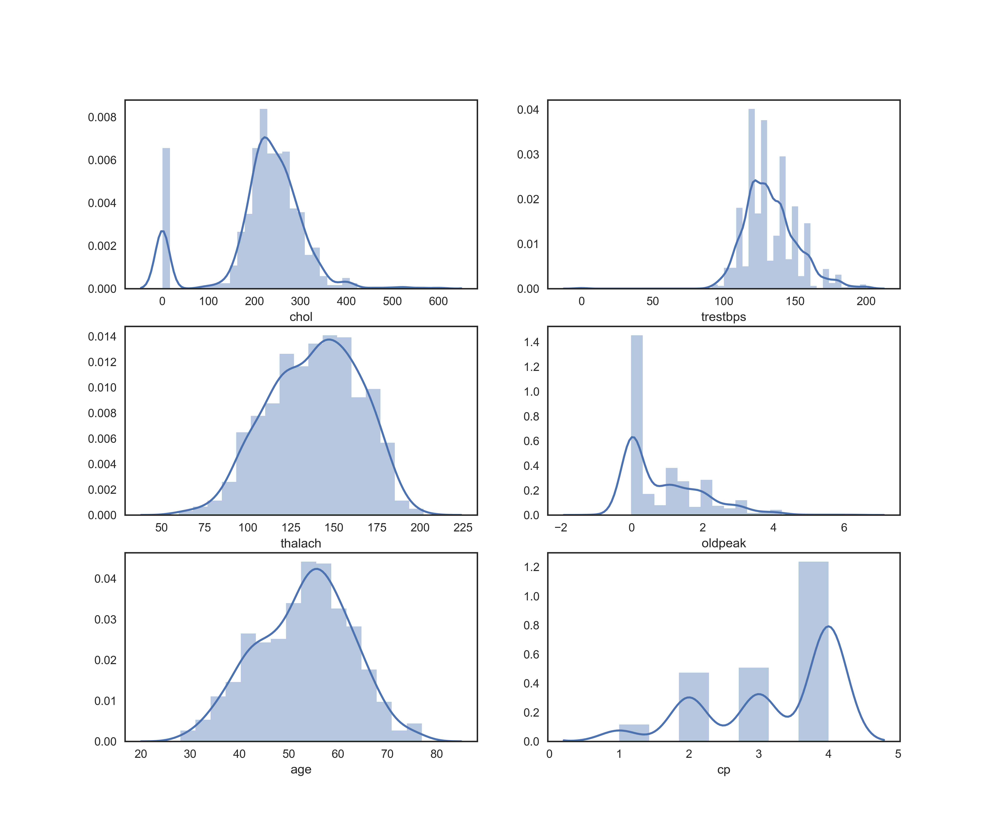

```{r setup, include=FALSE}
knitr::opts_chunk$set(echo = TRUE)
knitr::opts_chunk$set(fig.pos = 'h')
suppressMessages(library(tidyverse))
suppressMessages(library(ggplot2))
```

## Introduction
According to the Centers for Disease Control and Prevention, approximately $\frac{1}{4}$ of all deaths in the US are caused by heart disease [(source)](https://www.cdc.gov/dhdsp/data_statistics/fact_sheets/fs_heart_disease.htm). Many risk factors for heart disease are well documented, including the influence of diet and lack of physical activity. These features could be used to build a model to predict the presence or probability of an individual being diagnosed with heart disease, leading to early treatment and an improved quality of life. 

## The Data
The processed heart disease data used in this report were [downloaded](http://archive.ics.uci.edu/ml/datasets/heart+Disease) from the University of California Irvine machine learning repository. The data sets for Cleveland, Hungary, Long Beach, and Switzerland, each contain a subset of 14 of the original 76 features, and are intended for classification. The outcome is a multiclass label ranging from 0 (no heart disease) to 4, and the values of 1,2,3, and 4 reflect the presence of heart disease. 

## Exploratory Data Analysis 
Missing values are scattered throughout the heart disease data sets, and are visualized below in a heatmap. Since the majority of the slope of peak exercise (slope), number of major vessels visualized (ca), and thal features contained missing values, and the reasons the values were missing are unknown, these features were removed. The remaining missing values count is listed in the table below. Similar to the case of the three removed features, the reasoning for the missing values in the remaining features is unknown. Therefore, all patients with missing values were removed for this exploration in model and feature selection. The counts of discrete variables and distributions of continue variables are visualized below. 

```{r, echo=FALSE}
suppressWarnings(suppressMessages(null_vals <- readr::read_csv("../data/clean_data/null_val_table.csv")))
colnames(null_vals) <- c("Feature", "Missing Values Count", "Percentage of Feature that is Missing Values")
knitr::kable(null_vals, caption="Missing Values by Feature")
```


{width=400px}

{width=400px}

\pagebreak 

## Feature Selection

It needs to be highlighted that the imported data set is the result of prior feature selection, where the original data set has been reduced from 76 features to 14. Therefore, this exploration performs further feature reduction and the models will likely produce poor results. 

Three methods of feature selection are compared in this report. A logistic regression estimator with a l1 regularization penalty is used in the `sklearn` feature selection method `SelectFromModel` and its output is used in linear support vector classification. Since this data set contains only 828 complete observations, the linear support vector classifier was appropriate for the purposes of classification. A The second feature selection method is using the linear support vector classification supervised learning method with a l1 regularization penalty. This feature selection method was used  Finally, a linear support vector classifier is used as the estimator in recursive feature elimination to select the most important features. These results are passed to the k nearest neighbours classifier to predict the presence of heart disease. 

## Results
The results of each implementation of feature selection and the performance of its model are listed in the table below. The validation error rate of the linear support vector classifier approximated the test error rate well. This was the only model that performed better than chance.   

```{r, echo=FALSE}
suppressWarnings(suppressMessages(feat_select <- readr::read_csv("../data/clean_data/results.csv")))
feat_select <- feat_select[-c(1,4)]
colnames(feat_select) <- c("Implementation of Feature Selection", "Model", "Training Error Rate", "Validation Error Rate",
                           "Test Error Rate")
knitr::kable(feat_select)
```

The linear support vector classifier retained all features.  By default, RFE reduces to half the amount of features. The uncertainty in using this for feature reduction is we are unable to identify whether the RFE has removed equally important features to reach the 50% cut off, or if unimportant features are retained to satisfy this requirement. 

```{r, echo=FALSE}

```

## Conclusion

In conclusion, it is highly likely each of the already reduced features are important for classification of heart disease for this data set. By further reducing these features, models are built that generally perform poorly on test data. The linear support vector classifier using an l1 regularization for feature reduction performed the best, and was the only model to perform better than chance on the test data. The validation error rates of the linear support vector classifier with features reduced by a logistic regression estimator using `sklearn`'s `SelectFromModel` method and a k nearest neighbours implementation with features reduced by recursive feature elimination using a support vector linear classifier were poor estimates of the test error rates. The training and validation error rates of the KNN model were approximately equal, and the slightly larger validation error could either be due to chance, or is an indication of a model that is a poor fit to the training data. In order to improve model accuracy, feature selection should be applied to the original data set containing all 76 features.


