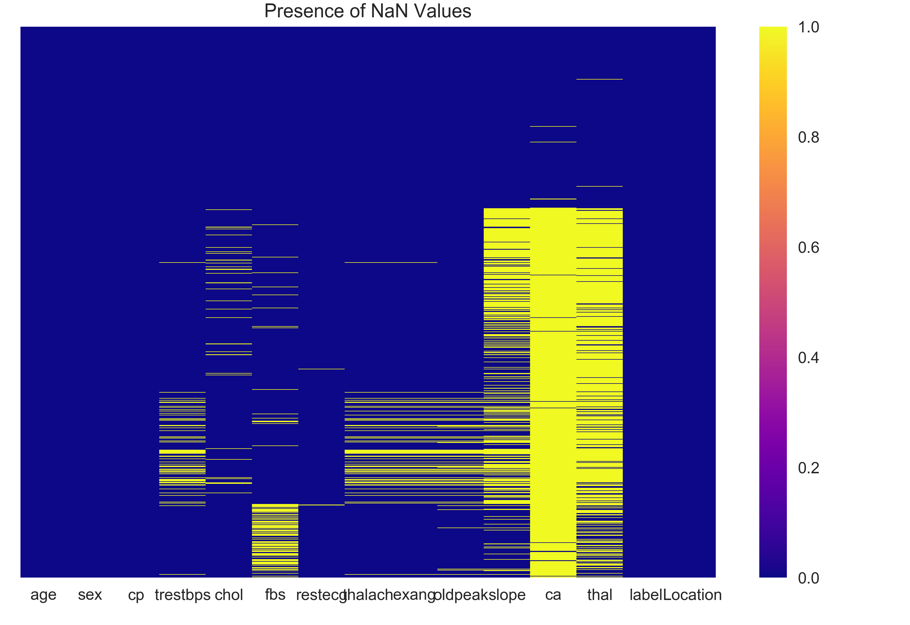

```{r setup, include=FALSE}
knitr::opts_chunk$set(echo = TRUE)
knitr::opts_chunk$set(fig.pos = 'h')
library(png)
library(grid)
```

## Introduction
According to the Centers for Disease Control and Prevention, approximately $\frac{1}{4}$ of all deaths in the US are caused by heart disease [(source)](https://www.cdc.gov/dhdsp/data_statistics/fact_sheets/fs_heart_disease.htm). Many risk factors for heart disease are well documented, including the influence of diet and lack of physical activity. These features could be used to build a model to predict the presence or probability of an individual being diagnosed with heart disease, leading to early treatment and an improved quality of life. 

## The Data
The processed heart disease data used in this report were [downloaded](http://archive.ics.uci.edu/ml/datasets/heart+Disease) from the University of California Irvine machine learning repository. The data sets for Cleveland, Hungary, Long Beach, and Switzerland, each contain a subset of 14 of the original 76 features, and are intended for classification. The outcome is a multiclass label ranging from 0 (no heart disease) to 4, and the values of 1,2,3, and 4 reflect the presence of heart disease. 

## EDA

{width=300px}


```{r, echo=FALSE}
suppressWarnings(suppressMessages(null_vals <- readr::read_csv("../data/clean_data/null_val_table.csv")))
feat_descpt <- c("Age", "Sex", "Chest Pain Type", "Resting Blood Pressure", "Cholestoral", "Fasting Blood Sugar > 120mg/dl?",
                 "Resting ECG Results", "Maximum Heart Rate", "Did exercise induce the heart attack?", "ST depression",
                 "Diagnosis of Heart Disease", "Location of Data Collection")
null_vals$Feat_descr <- feat_descpt
null_vals <- null_vals[, c("X1", "Feat_descr", "null_val_count", "percent_null_vals")]
colnames(null_vals) <- c("Feature", "Feature Description", "Missing Values Count", "Percentage of Missing Values in Feature")
knitr::kable(null_vals)
```


{width=300px}

{width=300px}

```{r, echo=FALSE}
suppressWarnings(suppressMessages(feat_select <- readr::read_csv("../data/clean_data/results.csv")))
knitr::kable(feat_select[-1])
```

```{r, echo=FALSE}
suppressWarnings(suppressMessages(no_feat_select <- readr::read_csv("../data/clean_data/results2.csv")))
knitr::kable(no_feat_select[-1])
```


